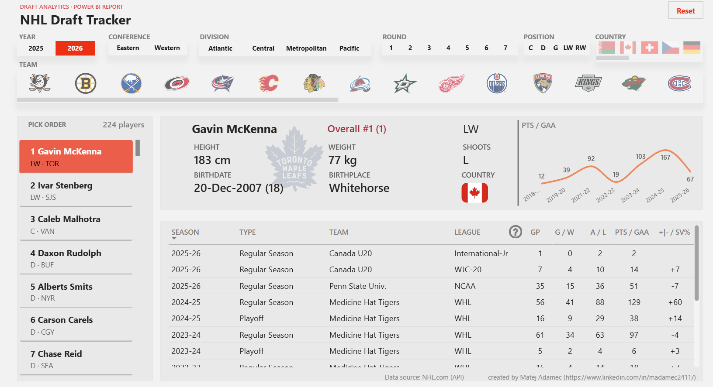
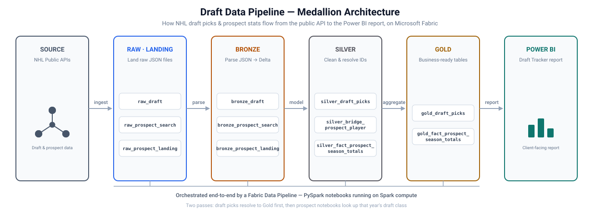

# About the project

This project turns NHL Entry Draft data — draft picks and the pre-NHL stats of the prospects who get picked — into a live, interactive report. Raw data is pulled from the NHL's public APIs, progressively cleaned and modeled through a **medallion (Bronze/Silver/Gold) architecture** built with **PySpark notebooks** on **Microsoft Fabric**, and served to a **Power BI report** — the client-facing product end users actually interact with.

**[View the Draft Tracker report ↗](https://app.powerbi.com/view?r=eyJrIjoiNTU3NjFmZGYtZWMxZi00YTkxLWJiZWUtZWY4ZDhkZWYzY2MwIiwidCI6IjNiMWFhNTk5LTZjZjctNDg5MS1hNDEyLWY2MTY0MmI0ZjQ1NiJ9&pageName=439df230747362b835ee)**

## How the Draft data pipeline works

The diagram below shows the full path data takes for the Draft Tracker report, from the NHL's API to the final report. Each colored stage is a **layer of the medallion architecture**, and every item inside it is a real **PySpark notebook** in this repo — all of them chained together and run automatically by a single Microsoft Fabric Data Pipeline.

| Layer | What happens here |
|---|---|
| **Raw / Landing** | The exact JSON responses pulled from the NHL's public API are saved as-is — an unaltered copy of the source data. |
| **Bronze** | That JSON is parsed into structured Delta tables — still close to the source, but now queryable. |
| **Silver** | Data is cleaned, de-duplicated, and prospect identities are resolved and linked across sources. |
| **Gold** | Business-ready fact and dimension tables, shaped specifically for reporting. |
| **Power BI** | The **Draft Tracker** report reads directly from the Gold layer (via Direct Lake — no separate data copy or refresh lag) and is what end users actually see. |

For the full technical write-up of this pipeline, including how it handles the draft-picks-then-prospects dependency and re-runs safely year over year, see [`docs/Draft_pipeline.md`](docs/Draft_pipeline.md) and [`docs/Draft_setup_doc.md`](docs/Draft_setup_doc.md).